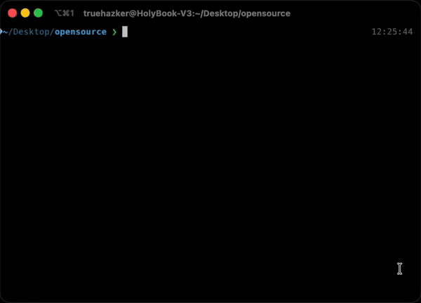

# create-ely

[](https://github.com/truehazker/create-ely/actions/workflows/lint.yml)
[](https://www.npmjs.com/package/create-ely)
[](https://opensource.org/licenses/MIT)

[](https://bun.sh)
[](https://elysiajs.com)
[](https://www.typescriptlang.org/)
[](https://www.postgresql.org/)

The fastest way to scaffold production-ready [ElysiaJS](https://elysiajs.com) projects with [Bun](https://bun.sh).



## Quick Start

Create a new project:

```bash
bun create ely
```

Or with a project name:

```bash
bun create ely my-project
```

You'll be prompted to choose:

- **Backend Only** - API-first ElysiaJS backend with PostgreSQL, Drizzle ORM, and OpenAPI docs
- **Monorepo** - Full-stack setup with React frontend, TanStack Router, and shared workspace

## What's Included

**Backend Template:**

- PostgreSQL + Drizzle ORM for type-safe database access
- OpenAPI documentation out of the box
- Global error handling and structured logging (Pino)
- Docker support for development and production
- Environment validation with type safety

**Monorepo Template:**

- Everything from Backend template
- React frontend with TanStack Router and Vite
- Bun workspaces for seamless monorepo management

## Contributing

> **⚠️ Important:** This project uses Git submodules for templates. Make sure to clone with `git clone --recurse-submodules` or run `git submodule update --init --recursive` after cloning.

See [CONTRIBUTING.md](./CONTRIBUTING.md) for development setup and guidelines.

## License

MIT
